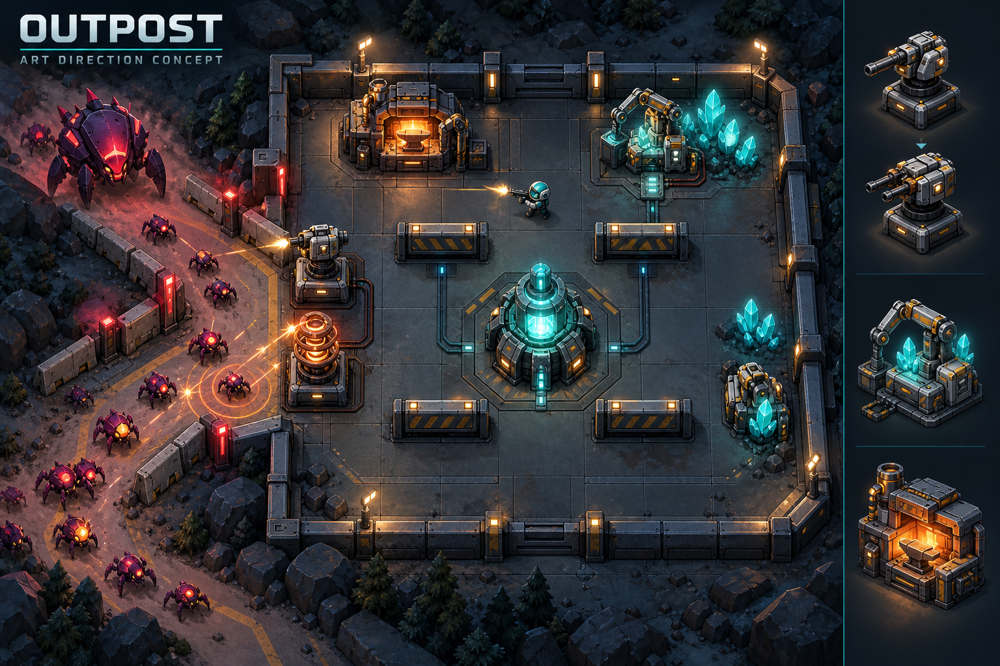

# OUTPOST — 입구 방어와 성장 빌드 확장안

2026-09-08 · **설계 제안 / 미구현**. v2.1.0은 그래픽을 개선하면서 v2.0.0의 30초 준비·3공세 규칙을 유지한다. 실제 게임 기능은 [README](../README.md)에 있다. 이 문서의 새 기능·수치·플레이 시간은 구현·플레이테스트를 거치기 전의 목표이며, 기존 배포본의 기능으로 소개하지 않는다.

## 만들고 싶은 경험

> 30초 동안 직접 준비한다. 초반을 어렵게 버티며 생산에 투자할 수도, 즉시 전투력을 확보할 수도 있다. 무너지는 입구를 수리하고 자원을 어디에 쓸지 판단한 결과, 마지막 공세에는 처음과 다른 화력으로 싸운다.

1인, Unreal C++, 맵 1개를 유지한다. ‘7인 입구막기’에서는 입구 배치·역할 분담·성장의 감각을 참고하며 실제 7인 네트워크 게임으로 확장하는 것은 이번 안에 포함하지 않는다. 원작 캐릭터·맵·모델은 사용하지 않는다.

**시작할 때 직업이나 빌드 카드를 선택하지 않는다.** 1 무기 / 2 곡괭이 / 3 맨손을 바꾸며 이동·채굴·건설·대장간 작업을 직접 수행한다. 서로 다른 소비 선택이 쌓여 빌드가 만들어지고 중간에 섞거나 전환할 수 있다.

## 현재 버전이 빨리 단조로워지는 이유

- 화력 2단계와 보호구 1단계가 주 소비처라 광석을 모은 다음 대장간에 가는 순서가 비슷하다.
- 모든 적이 플레이어를 쫓는다. 지켜야 할 고정 목표가 없어 방어 진지보다 계속 도망치며 쏘는 방식의 가치가 크다.
- 방벽은 내구도가 없다. 좋은 우회 배치를 찾으면 그것을 유지·보수할 이유가 적다.
- 3공세·30마리의 짧은 구성에는 경제 투자 회수와 상위 장비를 충분히 사용하는 구간이 없다.
- 전투 중 작업은 가능하지만, 사격을 멈추고 다른 일을 해야 할 만큼 매력적인 소비처와 전황 변화가 부족하다.

근거: `Source/Outpost2D/OutpostSimulation.h/.cpp`의 MaxRank, Walls, StartUpgrade, UpdateEnemies, Counts, BeginWave.

## 한 스테이지의 구조

목표는 **발전기와 플레이어가 살아 있는 상태로 최종 보스와 잔여 적을 격퇴**하는 것이다. 준비는 30초, 전체 플레이 시간은 약 4~5분을 목표로 한다. 새로운 맵 여러 개 대신 같은 진지에서 6공세를 겪는다.

입구는 하나지만 안쪽은 중앙 장애물을 중심으로 두 갈래로 갈라졌다가 발전기 앞에서 합쳐진다. 방벽을 어느 쪽으로 옮겼는지에 따라 우회 거리와 포탑의 사격 구간이 달라진다. 위험한 광맥은 입구 가까이, 적은 양의 안전 광맥은 안쪽에 두어 채굴 위치에도 선택을 만든다.

적의 기본 목적지는 발전기다. 플레이어가 가까이서 사격하거나 수리하면 일부 적이 짧게 플레이어를 공격한다. 진지 밖으로 오래 유인하면 발전기로 복귀해 무한 유인만으로 해결되지 않게 한다. 시야·거리·어그로 유지시간은 별도 규칙으로 구현하고 공격 대상을 표시한다.

| 공세 | 역할 | 플레이어에게 주는 판단 |
| --- | --- | --- |
| 1 | 보통 적, 기본 무기로도 대응 가능한 압박 | 즉시 강화할지 미래 생산에 투자할지 |
| 2 | 빠른 적 무리 | 포탑 배치와 광맥에 머물 시간을 조정 |
| 3 | 방벽 파괴자 | 우회로 유지, 수리, 파괴자 우선 처치 |
| 4 | 밀집 공세 | 투자 회수와 관통·범위 공격의 첫 보상 |
| 5 | 빠른 적 + 파괴자 | 만들어 둔 빌드의 약점을 직접 전투로 보완 |
| 6 | BREAKER + 소규모 호위 | 성장한 화력을 사용하면서 파괴 예고에 대응 |

초기 시간표 초안은 준비 종료를 0초로 두고 0/35/70/105/140/175초에 공세가 시작되는 것이다. 모두 처치하면 다음 공세까지의 시간이 재정비 시간이 된다. 마지막 적을 남겨도 다음 공세와 투자 회수 시각이 멈추지 않는다. 마지막 공세는 적을 모두 처리할 때까지 이어진다. 보스전이 45~75초 걸릴 경우 총 250~280초가 되며, 실제 시간은 플레이테스트로 확인한다.

동시 적 수·생성 대기열의 상한을 정의하고, 상한을 이유로 필수 적이 누락되거나 승리 조건이 먼저 충족되지 않도록 한다. 다음 공세의 종류와 시작 시간을 HUD에 미리 표시한다.

## 행동으로 만들어지는 네 가지 빌드

| 빌드 예시 | 초반 행동 | 후반 보상 | 계속 치러야 하는 대가 |
| --- | --- | --- | --- |
| 직접 전투형 | 채굴한 광석으로 확정 무기 강화 | 높은 단일 대상 화력, 보스 우선 처치 | 직접 조준·회피에 집중하므로 작업 시간이 부족 |
| 공병형 | 기관포탑과 방벽에 먼저 투자 | 몰려오는 적을 오래 사격하는 방어 진지 | 포탑 정비와 파괴자 처리, 자리를 잘못 잡으면 효율 감소 |
| 성장형 | 첫 강화 대신 채굴 설비에 투자하고 기본 무기로 버팀 | 3~4공세부터 생산 회수, 상위 포탑·관통 무기 구성 | 첫 두 공세에 약하고 설비 보호에 공간을 사용 |
| 확률 가공형 | 기본 전투력을 확보한 뒤 대장간 특수 가공에 광석과 시간을 사용 | 운이 좋으면 이른 관통·연쇄 공격으로 전환 | 실패하면 당장의 포탑·강화 자금이 줄어듦 |

공병이 채굴 설비를 먼저 만들거나, 사수가 후반에 둔화탑을 추가하는 혼합도 허용한다. 메뉴의 분류가 아니라 플레이 결과를 설명하는 이름이다.

‘왕귀’는 피해 숫자만 늘리지 않는다. 기본 탄환이 여러 적을 관통하고, 단일 포신이 쌍열 포탑으로 바뀌며, 밀집 공세를 한 번에 처리하는 변화를 보여준다. 상위 공격을 마지막 몇 초에만 얻지 않도록 4공세부터 사용할 수 있게 하는 것이 목표다.

## 방벽·타워·수리

- 방벽에는 내구도를 주고 3번 맨손으로 가까이에서 수리한다. 수리는 광석과 작업 시간을 소모한다. 운반·취소·재배치가 내구도를 초기화하지 않게 한다.
- 일반 적은 열린 길로 우회한다. 파괴자는 지나치게 긴 우회를 만든 방벽을 예고 후 공격한다. 보스는 더 강한 파괴 공격을 사용한다. 경로가 없는 곳에서 영원히 멈추는 상태는 허용하지 않는다.
- 첫 검증판에는 기관포탑 1종을 넣고, 배치 판단이 재미있을 때 둔화탑을 추가한다. 기관포탑은 사격, 둔화탑은 이동 지연으로 역할을 분리한다. 둔화 중첩에는 상한을 둔다.
- 포탑 수에는 초기 상한을 두고 내구도와 긴 탄창을 사용한다. 정비는 한 공세에서 한두 번 고민할 정도가 목표이며, 몇 초마다 재장전하러 달려가는 반복 노동은 피한다.
- 포탑 사거리·예상 이동 경로·배치 불가 이유를 놓기 전에 보여준다. 낮은 방벽 너머 사격은 허용하되 맵의 높은 지형 너머 사격은 별도 시야 규칙을 따른다.
- 배치 검사는 플레이어만이 아니라 발전기의 접근 가능한 외곽 셀까지 검사한다. 모든 입구·살아 있는 적에 대해 경로가 남아야 하고, 광석·작업대 접근도 유지한다. 적과의 겹침 금지와 방벽 변경 후 재경로 탐색은 유지한다.

## 경제 투자와 시간

생산 설비는 최대 1개로 시작한다. 원금이 자동으로 재투자되는 복리 이자 대신, 가동 시간에 따른 제한된 추가 생산을 사용한다. 초반 투자 비용과 5초 작업을 포기한 대가가 첫 두 공세에서 느껴져야 한다.

**미검증 계산 예시:** 비용 18광석, 완공 후 12초마다 3광석, 총 생산 상한 36광석이면 회수 시간은 72초이고 최대 순이익은 18광석이다. 이는 후보값이며, 현재 수동 채굴 속도(약 2.22광석/초)·위험·이동 시간을 함께 놓고 조정해야 한다. 실제 설계 목표는 3공세 부근 회수, 4공세부터 체감되는 상위 장비다. 숫자만 적용하면 재미가 보장된다고 보지 않는다.

메뉴·일시정지·승패 확정 후에는 생산하지 않는다. 파괴된 설비는 생산이 정지한다. 회수·재설치로 지급 시계나 생산 상한이 초기화되지 않게 한다. 적 처치 보상은 플레이어와 타워 처치에 동일하게 적용하고, 한 적에서 중복 지급하지 않는다. 처치 보상 규모는 총 광석 예산을 정할 때 함께 결정한다.

## 확률 가공: 선택의 위험을 만들기

대장간에서 실제로 이동해 작업하는 방식이며 시작 화면 뽑기는 없다. 기본 무기 강화는 확정으로 유지한다. 특수 가공은 광석과 5초의 작업 시간을 걸고 관통·연쇄 같은 다른 공격 방식을 일찍 노리는 선택이다. 현금·유료 재화는 사용하지 않는다.

초기 확률 규칙 후보:

- 2공세 이후 얻는 가공 기회로만 시도하고 한 판 최대 3회, 같은 공세에서는 최대 1회만 허용한다.
- 광석 14개와 5초를 지불한다. 성공 확률은 40%, 실패 확률은 60%로 정확히 표시한다.
- 실패해도 기존 무기가 파괴되거나 강화 단계가 내려가지 않는다. 실패 1회가 다음 시도의 누적 진척이 된다.
- 두 번 연속 실패하면 세 번째 시도는 확정 성공이다. 화면에는 현재 확률과 남은 확정 성공 조건을 표시한다.
- 성공 보상은 보스 단일 화력까지 압도하는 범용 배율 대신 밀집 공세에 유리한 관통·연쇄 효과로 시작한다.
- 4공세부터 같은 계열 모듈의 확정 제작도 제공한다. 예를 들어 확정 비용 28광석과 비교하면 확률 가공의 예상 비용은 14×(1+0.6+0.36)=27.44광석, 최악 비용은 42광석이다. 이 계산은 기회·시간·생존 비용을 제외한 것이므로 최종 밸런스 판정은 아니다.

작업 완료 전에 취소하면 기존 규칙대로 광석을 환불하고 결과는 공개하지 않는다. 미완료·취소로 확률이나 실패 진척을 반복 갱신하지 않는다. 한 런의 시드와 완료 결과를 기록해 테스트에서 재현한다. 완전히 새 게임을 시작하는 것은 허용하며 리세마라를 기술적으로 완전히 막았다고 주장하지 않는다. 첫 추첨을 중반에 배치하고 실패 후 계속할 이유를 주는 것으로 재시작 유인을 줄인다.

## 그래픽과 도구의 역할

위 이미지는 **AI 콘셉트 시안**이다. 실제 플레이 캡처나 완성된 게임 에셋이 아니며, 장식·투영·통로 폭을 그대로 충돌 맵으로 사용하지 않는다. [전체 생성 프롬프트와 도구 기록](Concepts/outpost-build-defense-prompt.txt)을 보관한다.

목표는 복잡한 사실적 3D가 아니라, 작은 화면에서도 구분되는 공병·금속 포탑·광맥·방벽·괴물이다. 높이와 재질이 보이는 2.5D 아트에 기존의 즉각적인 조작을 결합한다. 팀 색은 청록, 위험 예고는 붉은색, 작업·강화는 주황색으로 구분한다.

| 도구 | 이 프로젝트에서 맡길 일 | 게임에 적용하는 방법 |
| --- | --- | --- |
| 내장 이미지 생성 | 아트 방향, 배경 재질, UI 아이콘, 적·구조물 디자인 시안 | 선정 후 실제 크기에서 읽히는지 확인하고 프로젝트에 import |
| Blender 4.5.9 portable + `Tools/blender_outpost_art.py` | DesignV3 방향별 스프라이트 아틀라스와 절차적 원본 장면 | 68° 고각 직교 카메라로 렌더링한 PNG를 Unreal Canvas에서 사용 |
| Google Flow / Gemini Omni 계열 | 짧은 오프닝, 보스 등장 영상, 분위기 프리비주얼 | 영상으로 분리하고 실제 공격 판정·경로·강화 규칙은 C++에서 구현 |

‘Omni’는 Google Flow와 함께 언급된 문맥에서 Gemini Omni 계열을 뜻한다고 가정했다. 다른 서비스라면 해당 도구 선택 부분만 다시 확인한다. Google 공식 도움말은 Flow를 영상 제작 도구로 소개하며 Gemini Omni Flash 접근을 설명한다. 실제 기능·연결 상태는 사용 시 확인한다.

2026-09-08 현재 Blender MCP·Flow의 직접 연결이나 Higgsfield 사용은 주장하지 않는다. DesignV3 아틀라스는 공식 서버에서 SHA를 확인한 Blender 4.5.9 portable runtime과 `Tools/blender_outpost_art.py`로 생성한다.

현재 렌더러는 Unreal Canvas에서 `/Game/Outpost/DesignV3`의 `T_SpritesAtlas`, `T_ArenaFloor`, `T_KeyArt`를 사용한다. 캐릭터와 적은 `sprites_atlas.json`의 방향·셀·앵커를 따르고 월드 오브젝트는 ground Y 기준으로 정렬한다. 텍스처가 없으면 기존 절차적 Canvas 표현으로 폴백하며, 지형 충돌과 경로 규칙은 바뀌지 않는다. 아틀라스의 `generator`와 `turret`는 미래 디자인 에셋으로 현재 기능성 게임 오브젝트가 아니다.

이 문서의 방벽 내구도·수리, 타워·생산 설비, 추가 공세, 확률 가공과 경제 수치는 여전히 설계 제안이며 구현·플레이테스트 전의 미구현 범위다.

참고: [Blender MCP 프로젝트](https://github.com/ahujasid/blender-mcp), [Google Flow 공식 도움말](https://support.google.com/flow/answer/16353333?hl=en). 도구 용도와 제작 순서는 이 프로젝트의 범위에 맞춘 제안이다.

## 가장 작은 재미 검증판과 구현 순서

1. 발전기와 분기형 입구, 적의 발전기 추적·짧은 플레이어 어그로 전환을 만든다.
2. 방벽 내구도·수리와 기관포탑 1종을 넣어 ‘사격할지 정비할지’ 판단을 확인한다.
3. 6공세 시간표, 생산 설비 1종, 후반 관통 무기를 연결해 즉시 강화와 늦은 투자를 비교한다.
4. 가공 확률·실패 진척·확정 제작을 추가하고, 실패 이후에도 전투를 계속할 가치가 있는지 확인한다.
5. 기본 재미가 확인되면 둔화탑과 실제 2.5D 에셋, 소리·연출을 적용한다. 영상은 이 흐름을 방해하지 않는 짧은 선택 요소로 둔다.

초기 판에는 맵 여러 개, 실제 멀티플레이, 장비 수십 종, 복잡한 스킬 트리를 추가하지 않는다. 최종 스코어는 남은 광석만 우대하지 않도록 발전기 상태·생존·공세 대응을 함께 본다. 기존 점수와 비교되지 않도록 규칙 버전별 기록을 구분한다.

## 구현·검증 시 확인할 것

- 기존 FSimulation에 구조물 종류·내구도·타겟 식별자·생산 상태·런 시드를 추가하고, GameMode와 HUD는 상태를 읽어 표시한다. 규칙을 렌더링 코드에 넣지 않는다.
- 구조물 파괴·운반·취소 후에도 발전기까지의 길, 적의 목표, 내구도와 비용이 일관되는지 검사한다.
- 고정 시간 공세에서 적이 밀려도 생성 수·보상·승리 조건이 누락되지 않는지 검사한다.
- 일시정지·종료·설비 회수로 생산을 복제할 수 없는지, 광석 지불·환불·보상이 한 번씩만 적용되는지 검사한다.
- 확률은 고정 시드로 성공·실패·실패 두 번 뒤 보장·취소를 재현한다. 기대값 계산만으로 재미를 검증했다고 하지 않는다.
- 직접 전투형, 공병형, 성장형, 확률 가공 실패 런을 각각 끝까지 플레이한다. 같은 조준 자동 조종기만으로 빌드 간 승률이나 재미를 판정하지 않는다.
- 특히 **전투 중 사격을 멈추고 채굴·수리·투자를 하러 갈 이유가 실제로 생겼는지**, **초반 투자 빌드가 회수 전에 합리적으로 살아남을 수 있는지**, **어떤 빌드가 모든 상황에서 우월하지 않은지**를 사람 플레이로 확인한다.

DesignV3 시각 에셋 생성·import·Canvas 연결은 구현되어 있다. 이 문서가 제안하는 새 게임 규칙과 타워·경제·확률 가공은 여전히 미구현이며, 빌드·테스트 결과는 [검증 기록](VALIDATION.md)에 버전별로 남긴다.
