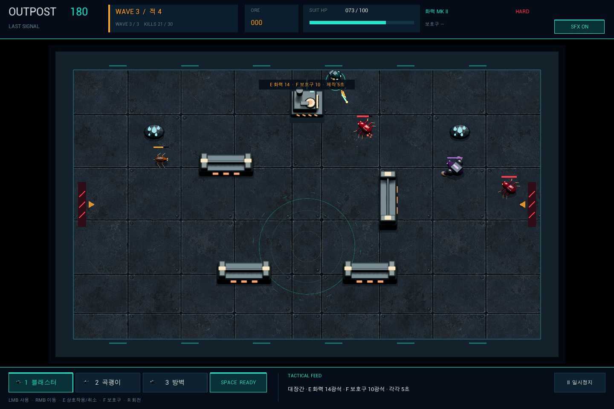

# OUTPOST 2D



`OUTPOST 2D`는 넥토리얼(NEXON COMPANY) 지원 포트폴리오를 위해 만든 Unreal Engine 5.8 native C++ 2D 방어 게임입니다. 1440×960 기준의 한 화면 아레나에서 준비 시간의 자원 배분과 실시간 전투를 연결했습니다. 게임 규칙, 입력, 화면, 저장을 C++로 구현했습니다.

**[Windows 게임 다운로드](https://github.com/ejrejrwo/Nex_outpost-defense/releases/download/v2.1.0/Outpost2D-Windows.zip)** · [배포 버전과 소스 압축 파일](https://github.com/ejrejrwo/Nex_outpost-defense/releases/tag/v2.1.0) · [기술 개요](Docs/TECHNICAL_OVERVIEW.md) · [검증 기록](Docs/VALIDATION_2.1.md)

## v2.1.0 그래픽 업데이트

Blender로 제작한 8방향 공병·괴물 스프라이트와 대장간·광석·방벽을 실제 전투 화면에 적용했습니다. 내장 이미지 생성기로 만든 금속 바닥과 타이틀 아트를 더하고, 메뉴와 전투 HUD를 정리했습니다. 모델 원본 `.blend`, 생성 스크립트, 이미지 프롬프트를 소스에 함께 보관합니다.

이번 업데이트는 그래픽 개선입니다. 아래의 기존 30초 준비·3공세 규칙을 유지합니다. 타워·발전기 방어·확률 가공·성장 빌드는 [별도 확장 기획](Docs/BUILD_DEFENSE_PLAN.md)이며 현재 플레이 기능에 포함하지 않습니다.

## 게임 흐름

30초 동안 광석을 채굴하고 화력 또는 보호구를 5초 동안 강화합니다. 이후 7명·10명·13명의 세 웨이브, 총 30명의 공세를 상대하며 마지막에는 최종 보스 `BREAKER`가 등장합니다. `hard`와 `practice` 모드를 제공합니다.

전투 중 채굴·강화·방벽 운반까지 한 흐름으로 연결합니다. 총·곡괭이·맨손은 준비·전투·휴식 중 전환할 수 있고, 전투 중 대장간 작업 중에도 적은 공격합니다. E로 취소하면 광석은 돌려받지만 이미 흐른 시간은 돌아오지 않습니다.

## 조작

| 입력 | 동작 |
| --- | --- |
| WASD / 방향키 | 이동 |
| 마우스 좌클릭 | 총 사격, 곡괭이 사용, 맨손 방벽 상호작용 |
| 마우스 우클릭 | 지정 위치로 이동 |
| 1 / 2 / 3 | 총 / 곡괭이 / 맨손 |
| E | 채굴 시작·중지, 화력 강화, 방벽 들기·놓기, 강화 취소 |
| F | 보호구 강화 |
| Space | 회피, 3.2초 재사용 대기 |
| R | 운반 중 방벽 회전 |
| Enter | 시작·조기 출격·재시작 |
| Esc | 일시정지 |

총은 도구 1에서만 발사합니다. 방벽을 들면 이동 속도가 112로 낮아지고 사격·회피가 잠깁니다. 살아 있는 적과 겹치는 배치와 적을 완전히 가두는 배치는 별도 경로 검사로 거부됩니다. 마지막 보스는 넓은 공격 범위를 미리 표시하고, 체력이 절반 아래로 내려가면 공격 속도가 빨라집니다.

## 실행

### Windows 패키지

[Releases에서 `Outpost2D-Windows.zip`을 다운로드](https://github.com/ejrejrwo/Nex_outpost-defense/releases/tag/v2.1.0)하고 전체 압축을 해제한 뒤 `PLAY.cmd` 또는 `Outpost2D.exe`를 실행합니다. Unreal Editor 설치 없이 플레이할 수 있으며, 패키지에는 실행에 필요한 Unreal 런타임이 포함됩니다. 프로젝트 루트의 `Play.cmd`는 로컬 `Release\Windows\Outpost2D.exe`를 찾아 실행합니다.

### 소스 프로젝트

Unreal Engine 5.8에서 `Outpost2D.uproject`를 열어 실행합니다. 소스를 빌드하려면 Visual Studio 2022의 C++ 게임 개발 도구와 Windows SDK가 필요합니다. 기본 맵은 `/Game/Outpost/Maps/OutpostArena`입니다. `Tools/build.ps1`에는 Editor 빌드, 자동 테스트, Windows 패키징 명령이 있습니다.

```powershell
.\Tools\build.ps1 -Action Editor
.\Tools\build.ps1 -Action Test
.\Tools\build.ps1 -Action Package
.\Tools\validate_package.ps1 -Mode hard -Rank 2
```

엔진 설치 경로가 기본값과 다르면 `-EngineRoot "D:\UE_5.8"`를 지정합니다. `Tools/export_portfolio.ps1`는 소스와 Windows 패키지를 작업 폴더 상위에 `Outpost2D-Source.zip`, `Outpost2D-Windows.zip`으로 내보냅니다. PowerShell 7에서 실행합니다.

## 코드 흐름

- `Source/Outpost2D/OutpostSimulation.*`: Unreal Actor·렌더링과 분리한 C++ 규칙·전투·경로·탄환 시뮬레이션
- `OutpostGameMode.*`: 입력, 고정 간격 Tick, 이벤트·사운드 연결, SaveGame 기록
- `OutpostArenaRenderer.*`: Unreal Canvas로 Blender 스프라이트와 바닥 텍스처, 공격 예고·효과를 렌더링
- `OutpostHUD.*`: HUD 패널, 상태, 조작 안내, 모드·최고 기록 UI
- `OutpostPlayerController.*`: 키보드·마우스 입력
- `OutpostSaveGame.*`: `OutpostNative2` 슬롯의 hard/practice 최고 기록 저장

## AI 협업 공개

AI는 C++ 구현 보조, Blender 모델 생성 스크립트, 내장 이미지 생성 기반 바닥·타이틀 아트, 표준 라이브러리 기반 사운드 생성, 문서화와 검증 절차 보조에 참여했습니다. 게임 규칙과 제품 방향은 사람의 기획 판단으로 정했으며, 생성·보조 코드와 아트의 범위를 구분해 기록했습니다. 현재 사용하는 아트는 `SourceArt/DesignV3`에 있습니다. [에셋 기록](Docs/ASSETS.md)과 [기술 개요](Docs/TECHNICAL_OVERVIEW.md)를 참고하십시오.

## 검증

최신 빌드·자동 테스트·GPU 플레이 결과는 [v2.1 검증 기록](Docs/VALIDATION_2.1.md)에 기록합니다. [v2.0 기록](Docs/VALIDATION.md)도 보존합니다. 자동 조작 결과는 실제 사람 플레이의 승률을 뜻하지 않습니다.
